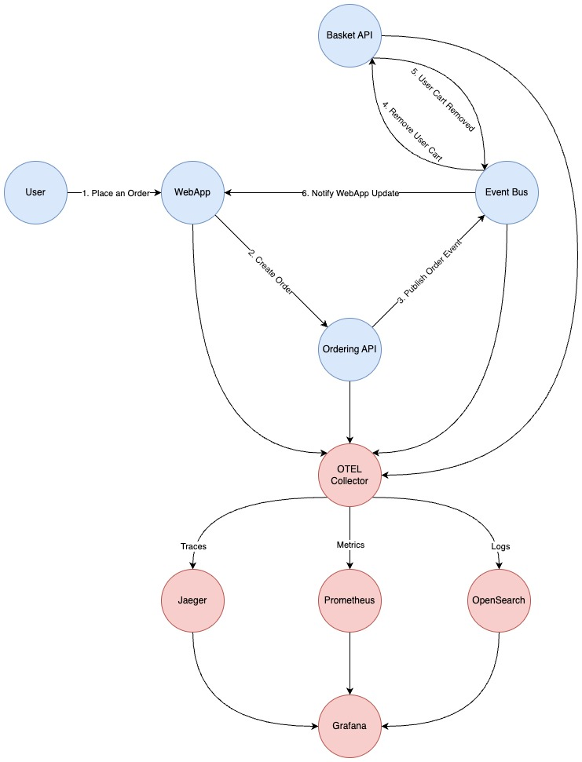

<!-- omit in toc -->
# eShop Observability Implementation Report

<!-- omit in toc -->
## Table of Contents

- [1. Selected Feature: Order Creation Flow](#1-selected-feature-order-creation-flow)
  - [1.1. Overview](#11-overview)
  - [1.2. My Trace Architecture Diagram](#12-my-trace-architecture-diagram)
- [2. Observability Implementation](#2-observability-implementation)
  - [2.1. Components Used](#21-components-used)
    - [2.1.1. OpenTelemetry Collector (OTEL-Collector)](#211-opentelemetry-collector-otel-collector)
    - [2.1.2. Jaeger](#212-jaeger)
    - [2.1.3 Prometheus](#213-prometheus)
    - [2.1.4. OpenSearch](#214-opensearch)
    - [2.1.5. Grafana](#215-grafana)
  - [2.2. eSHop Code Changes](#22-eshop-code-changes)
    - [2.2.1. Connection to OTEL Collector](#221-connection-to-otel-collector)
    - [2.2.4. Custom Trace Spans and Metrics](#224-custom-trace-spans-and-metrics)
    - [2.2.5. Trace Enrichment, Tagging and Metrics in Ordering API](#225-trace-enrichment-tagging-and-metrics-in-ordering-api)
      - [2.2.5.1 Span Creation](#2251-span-creation)
      - [2.2.5.2 Metrics Collection](#2252-metrics-collection)
      - [2.2.5.3 How It Works](#2253-how-it-works)
    - [2.2.6 Trace Enrichment, Tagging and Metrics in Basket API](#226-trace-enrichment-tagging-and-metrics-in-basket-api)
      - [2.2.6.1 Span Creation](#2261-span-creation)
      - [2.2.6.2 Metrics Collection](#2262-metrics-collection)
      - [2.2.6.3 How It Works](#2263-how-it-works)
  - [2.3. Jaeger Traces and Monitoring](#23-jaeger-traces-and-monitoring)
    - [2.3.1. Trace](#231-trace)
    - [2.3.2 Monitoring](#232-monitoring)
  - [2.3. Grafana Dashboards](#23-grafana-dashboards)
    - [2.3.1 General Dashboard](#231-general-dashboard)
      - [2.3.1.1. Spanmetrics (RED Metrics)](#2311-spanmetrics-red-metrics)
      - [2.3.1.2. Span Metrics](#2312-span-metrics)
      - [2.3.1.3. Log Records](#2313-log-records)
      - [2.3.1.4. Application Metrics](#2314-application-metrics)
      - [2.3.1.5. Service Dependency](#2315-service-dependency)
      - [2.3.1.6. Filters and Customization](#2316-filters-and-customization)
    - [2.3.2. Custom Metrics Dashboard](#232-custom-metrics-dashboard)
      - [2.3.2.1. Ordering API Metrics](#2321-ordering-api-metrics)
      - [2.3.2.2. Basket API Metrics](#2322-basket-api-metrics)
      - [2.3.2.3. Tracing \& Logging](#2323-tracing--logging)
      - [2.3.2.4. Filters and Customization](#2324-filters-and-customization)
    - [2.3.3. OTEL Collector Dashboard](#233-otel-collector-dashboard)
    - [2.3.4. Spanmetrics Dashboard](#234-spanmetrics-dashboard)
      - [2.3.4.1. Service Latency Quantiles](#2341-service-latency-quantiles)
    - [2.3.4.2. APM Table: Top 7 Spans \& Errors](#2342-apm-table-top-7-spans--errors)
- [3. Masking Sensitive Data](#3-masking-sensitive-data)
  - [3.1 OpenTelemetry Collector Configuration](#31-opentelemetry-collector-configuration)
  - [3.2. eShop Code Changes](#32-eshop-code-changes)
  - [3.3. Database-Level](#33-database-level)
    - [3.3.1. Creation of Users and Databases](#331-creation-of-users-and-databases)
    - [3.3.2. Restricting and Granting Connection Privileges](#332-restricting-and-granting-connection-privileges)
    - [3.3.3. Schema-Level Access Control](#333-schema-level-access-control)
- [4. Load Testing](#4-load-testing)
- [5. Gen AI Tools Usage](#5-gen-ai-tools-usage)
- [6. Challenges and Learnings](#6-challenges-and-learnings)
- [7. Conclusion](#7-conclusion)
- [8. GitHub Repository](#8-github-repository)


## 1. Selected Feature: Order Creation Flow

### 1.1. Overview

The **Order Creation Flow** is a critical feature of the eShop application. It defines the process by which a customer places an order for a product. The trace I implemented includes the following steps:

1. **Place an Order**: The customer confirms the order.
2. **Order Creation**: The system processes the request and generates a corresponding order.
3. **Publish Message on Event Bus**: The `ordering-api` publishes a message on the `event bus` notifying the need to delete the user's shopping cart.
4. **Delete User's Shopping Cart**: The `basket-api` receives the event and removes the user's cart, ensuring that items are not retained.
5. **Publish Order Status Update**: The `ordering-api` publishes another message on the `event bus`, informing the `webapp` about the order status update.
6. **Update WebApp Interface**: The `webapp` receives the event and updates the user interface to reflect the order status.

This flow ensures that orders are processed efficiently and synchronized across the different services of the eShop application.

### 1.2. My Trace Architecture Diagram



## 2. Observability Implementation

Observability has been implemented using a combination of **OpenTelemetry (OTEL), Jaeger, Prometheus, Grafana, and OpenSearch** to provide a comprehensive view of system performance, traceability, and metrics collection.

### 2.1. Components Used

#### 2.1.1. OpenTelemetry Collector (OTEL-Collector)

- Configured to collect traces, metrics, and logs from different services.
- Supports multiple receivers like `otlp`, `docker_stats`, and `hostmetrics`.
- Uses processors such as `memory_limiter`, `batch`, and `attributes` to manage collected data.
- Exports collected telemetry to Jaeger (for tracing), Prometheus (for metrics), and OpenSearch (for logs).

  ```yaml
  receivers:
    otlp:
      protocols:
        grpc:
          endpoint: "${OTEL_COLLECTOR_HOST}:${OTEL_COLLECTOR_PORT_GRPC}"
        http:
          endpoint: "${OTEL_COLLECTOR_HOST}:${OTEL_COLLECTOR_PORT_HTTP}"
          cors:
            allowed_origins:
              - "http://*"
              - "https://*"
    docker_stats:
      endpoint: "unix:///var/run/docker.sock"

    hostmetrics:
      root_path: /hostfs
      scrapers:
        cpu:
          metrics:
            system.cpu.utilization:
              enabled: true
        disk:
        load:
        filesystem:
          exclude_mount_points:
            mount_points:
              - /dev/*
              - /proc/*
              - /sys/*
              - /run/k3s/containerd/*
              - /var/lib/docker/*
              - /var/lib/kubelet/*
              - /snap/*
            match_type: regexp
          exclude_fs_types:
            fs_types:
              - autofs
              - binfmt_misc
              - bpf
              - cgroup2
              - configfs
              - debugfs
              - devpts
              - devtmpfs
              - fusectl
              - hugetlbfs
              - iso9660
              - mqueue
              - nsfs
              - overlay
              - proc
              - procfs
              - pstore
              - rpc_pipefs
              - securityfs
              - selinuxfs
              - squashfs
              - sysfs
              - tracefs
            match_type: strict
        memory:
          metrics:
            system.memory.utilization:
              enabled: true
        network:
        paging:
        processes:
        process:
          mute_process_exe_error: true
          mute_process_io_error: true
          mute_process_user_error: true

  exporters:
    debug: {} 
    otlp:
      endpoint: "jaeger:4317"
      tls:
        insecure: true
    otlphttp/prometheus:
      endpoint: "http://prometheus:9090/api/v1/otlp"
      tls:
        insecure: true
    prometheus:
      endpoint: "0.0.0.0:8889"
    opensearch:
      logs_index: otel
      http:
        endpoint: "http://opensearch:9200"
        tls:
          insecure: true

  processors:
    batch: {}
    memory_limiter:
      check_interval: 1s
      limit_percentage: 65
      spike_limit_percentage: 20
    attributes:
      actions:
        - key: event.userId
          action: update
          value: "****"
        - key: user.id
          action: update
          value: "****"

  connectors:
    spanmetrics: {}

  service:
    pipelines:
      traces:
        receivers: [otlp]
        processors: [memory_limiter, attributes, batch]
        exporters: [otlp, debug, spanmetrics]
      metrics:
        receivers: [hostmetrics, docker_stats, otlp, spanmetrics]
        processors: [memory_limiter, batch]
        exporters: [otlphttp/prometheus, prometheus, debug]
      logs:
        receivers: [otlp]
        processors: [memory_limiter, attributes, batch]
        exporters: [opensearch, debug]
    telemetry:
      metrics:
        level: detailed
        readers:
          - periodic:
              interval: 10
              timeout: 5
              exporter:
                otlp:
                  protocol: grpc
                  endpoint: "${OTEL_COLLECTOR_HOST}:${OTEL_COLLECTOR_PORT_GRPC}"
  ```

#### 2.1.2. Jaeger

 - Used for distributed tracing of requests across multiple microservices.
 - Receives trace data from OTEL Collector via OTLP protocol.
 - Stores trace data for visualization and debugging.

#### 2.1.3 Prometheus

 - Collects and stores time-series metrics from OTEL Collector.
 - Scrapes metrics from various system components such as OTEL Collector and application services.
 - Exposes a `/metrics` endpoint for further analysis.
   
    ```yaml
    global:
      scrape_interval: 5s
      scrape_timeout: 3s
      evaluation_interval: 30s

    otlp:
      promote_resource_attributes:
        - service.instance.id
        - service.name
        - service.namespace
        - cloud.availability_zone
        - cloud.region
        - container.name
        - deployment.environment.name

    storage:
      tsdb:
        out_of_order_time_window: 30m

    scrape_configs:
      - job_name: "otel-collector"
        metrics_path: /metrics
        static_configs:
          - targets: ["otel-collector:8889"]
    ```

#### 2.1.4. OpenSearch

   - Used as a centralized logging solution.
   - Stores logs received from OTEL Collector.
   - Enables log searching and filtering via OpenSearch Dashboards.
   - Configured in Grafana to enable real-time log monitoring and correlation with traces and metrics.
  
#### 2.1.5. Grafana

- Connects to Prometheus as a data source for visualizing metrics.
- Uses pre-configured dashboards for monitoring system health and performance.
- Installed with the `grafana-opensearch-datasource` plugin for integration with OpenSearch.
- Configured with multiple data sources:
   - **Prometheus** (metrics visualization) with a link to Jaeger for trace lookup.
      ```yaml
      apiVersion: 1

      datasources:
        - name: Prometheus
          uid: webstore-metrics
          type: prometheus
          url: http://prometheus:9090
          editable: true
          isDefault: true
          jsonData:
            exemplarTraceIdDestinations:
              - datasourceUid: webstore-traces
                name: trace_id

              - url: http://localhost:16686/jaeger/ui/$${__value.raw}
                name: trace_id
                urlDisplayLabel: View in Jaeger UI
      ```
    - **Jaeger** (trace visualization) for distributed tracing.
      ```yaml
      apiVersion: 1

      datasources:
        - name: Jaeger
          uid: webstore-traces
          type: jaeger
          url: http://jaeger:16686/jaeger/ui
          editable: true
          isDefault: false
      ```
    - **OpenSearch** (log visualization) to monitor application logs.
      ```yaml
      apiVersion: 1

      datasources:
        - name: OpenSearch
          uid: webstore-logs
          type: grafana-opensearch-datasource
          url: http://opensearch:9200/
          access: proxy
          editable: true
          isDefault: false
          jsonData:
            database: otel
            flavor: opensearch
            logLevelField: severity.text.keyword
            logMessageField: body
            pplEnabled: true
            timeField: observedTimestamp
            version: 2.19.0
      ```

### 2.2. eSHop Code Changes

#### 2.2.1. Connection to OTEL Collector

The `OTEL Collector` is the central component for collecting telemetry data from different services. To connect the eShop application to the OTEL Collector, I made the following changes:

```csharp
private static IHostApplicationBuilder AddOpenTelemetryExporters(this IHostApplicationBuilder builder)
    {
        var collectorHost = builder.Configuration["OTEL_COLLECTOR_HOST"] ?? "localhost";
        var collectorPortGrpc = builder.Configuration["OTEL_COLLECTOR_PORT_GRPC"] ?? "4317";
        var collectorUri = new Uri($"http://{collectorHost}:{collectorPortGrpc}");

        builder.Services.Configure<OpenTelemetryLoggerOptions>(logging => 
            logging.AddOtlpExporter(options =>
            {
                options.Endpoint = collectorUri;
                options.Protocol = OpenTelemetry.Exporter.OtlpExportProtocol.Grpc;
            }));

        builder.Services.ConfigureOpenTelemetryMeterProvider(metrics =>
        {
            metrics.AddOtlpExporter(options =>
            {
                options.Endpoint = collectorUri;
                options.Protocol = OpenTelemetry.Exporter.OtlpExportProtocol.Grpc;
            });
        });

        builder.Services.ConfigureOpenTelemetryTracerProvider(tracing => 
            tracing.AddOtlpExporter(options =>
            {
                options.Endpoint = collectorUri;
                options.Protocol = OpenTelemetry.Exporter.OtlpExportProtocol.Grpc;
            }));
        
        return builder;
    }
```

#### 2.2.4. Custom Trace Spans and Metrics

I added custom trace spans and metrics to the eShop application to provide more detailed insights into the order creation flow. This involved creating custom spans for each step of the flow and recording metrics for key operations.

```csharp
public static IHostApplicationBuilder ConfigureOpenTelemetry(this IHostApplicationBuilder builder)
    {
        builder.Logging.AddOpenTelemetry(logging =>
        {
            logging.IncludeFormattedMessage = true;
            logging.IncludeScopes = true;
        });

        builder.Services.AddOpenTelemetry()
            .WithMetrics(metrics =>
            {
                metrics.AddAspNetCoreInstrumentation()
                    .AddHttpClientInstrumentation()
                    .AddRuntimeInstrumentation()
                    .AddMeter("Experimental.Microsoft.Extensions.AI")
                    .AddMeter("eShop.Ordering.API")
                    .AddMeter("eShop.Basket.API");
            })
            .WithTracing(tracing =>
            {
                if (builder.Environment.IsDevelopment())
                {
                    tracing.SetSampler(new AlwaysOnSampler());
                }

                tracing.AddAspNetCoreInstrumentation()
                    .AddGrpcClientInstrumentation()
                    .AddHttpClientInstrumentation()
                    .AddSource("Experimental.Microsoft.Extensions.AI")
                    .AddSource("eShop.Ordering.API")
                    .AddSource("eShop.Basket.API");
            });

        builder.AddOpenTelemetryExporters();

        return builder;
    }
```

#### 2.2.5. Trace Enrichment, Tagging and Metrics in Ordering API

In the `CreateOrderAsync` method of the Orders API, trace enrichment and custom metrics are implemented using OpenTelemetry.

```csharp
public static class OrdersApi
{
    private static readonly ActivitySource ActivitySource = new("eShop.Ordering.API");
    private static readonly Meter Meter = new("eShop.Ordering.API");
    private static readonly Counter<long> CreateOrderAttemptsCounter = Meter.CreateCounter<long>("create.order.attempts", "count", "Total number of create order attempts");
    private static readonly Counter<long> CreateOrderSuccessCounter = Meter.CreateCounter<long>("create.order.success", "count", "Total number of create order successes");
    private static readonly Counter<long> CreateOrderFailureCounter = Meter.CreateCounter<long>("create.order.failure", "count", "Total number of create order failures");
    private static readonly Histogram<double> CreateOrderProcessingTime = Meter.CreateHistogram<double>("create.order.processing.time", "milliseconds", "Time taken to process create order command");

    public static async Task<Results<Ok, BadRequest<string>>> CreateOrderAsync(
        [FromHeader(Name = "x-requestid")] Guid requestId,
        CreateOrderRequest request,
        [AsParameters] OrderServices services)
    {
        using var activity = ActivitySource.StartActivity("CreateOrderAsync", ActivityKind.Server);
        activity?.SetTag("endpoint", "CreateOrder");
        activity?.SetTag("request.id", requestId);
        activity?.SetTag("user.id", request.UserId);

        var stopwatch = Stopwatch.StartNew();
        CreateOrderAttemptsCounter.Add(1);
        services.Logger.LogInformation("CreateOrderAsync: Attempting to create order.");

        if (requestId == Guid.Empty)
        {
            stopwatch.Stop();
            CreateOrderFailureCounter.Add(1);
            services.Logger.LogWarning("CreateOrderAsync: RequestId is empty. Aborting.");
            return TypedResults.BadRequest("RequestId is missing.");
        }

        using (services.Logger.BeginScope(new List<KeyValuePair<string, object>>
               { new("IdentifiedCommandId", requestId) }))
        {
            var maskedCCNumber = request.CardNumber.Substring(request.CardNumber.Length - 4)
                                   .PadLeft(request.CardNumber.Length, 'X');
            var createOrderCommand = new CreateOrderCommand(
                request.Items,
                request.UserId,
                request.UserName,
                request.City,
                request.Street,
                request.State,
                request.Country,
                request.ZipCode,
                maskedCCNumber,
                request.CardHolderName,
                request.CardExpiration,
                request.CardSecurityNumber,
                request.CardTypeId);

            var requestCreateOrder = new IdentifiedCommand<CreateOrderCommand, bool>(createOrderCommand, requestId);

            services.Logger.LogInformation("CreateOrderAsync: Sending command {CommandName} with Id {CommandId}",
                requestCreateOrder.GetGenericTypeName(), requestCreateOrder.Id);

            var result = await services.Mediator.Send(requestCreateOrder);
            stopwatch.Stop();
            CreateOrderProcessingTime.Record(stopwatch.ElapsedMilliseconds);

            if (result)
            {
                services.Logger.LogInformation("CreateOrderAsync: Order created successfully. RequestId: {RequestId}", requestId);
                CreateOrderSuccessCounter.Add(1);
            }
            else
            {
                services.Logger.LogWarning("CreateOrderAsync: Order creation failed. RequestId: {RequestId}", requestId);
                CreateOrderFailureCounter.Add(1);
            }

            activity?.SetTag("processing.time.ms", stopwatch.ElapsedMilliseconds);
            return TypedResults.Ok();
        }
    }
}
```

##### 2.2.5.1 Span Creation

 - A new span is started using `ActivitySource.StartActivity("CreateOrderAsync", ActivityKind.Server)` to track the execution of the CreateOrderAsync method.

 - The span includes multiple tags to provide context about the request:

   - `endpoint`: Identifies the API endpoint handling the request (CreateOrder).

   - `request.id`: Captures the unique identifier of the request.

   - `user.id`: Stores the ID of the user making the request.

   - `processing.time.ms`: Captures the total processing time of the order.

##### 2.2.5.2 Metrics Collection

The Meter API from OpenTelemetry is used to track key performance indicators:

  - **Counters:**

    - `create.order.attempts`: Tracks the total number of order creation attempts.

    - `create.order.success`: Counts the number of successfully created orders.

    - `create.order.failure`: Counts the number of failed order creation attempts.

  - **Histogram:**

    - `create.order.processing.time`: Records the time taken (in milliseconds) to process an order request.

##### 2.2.5.3 How It Works

- **Attempt Tracking:** Every time `CreateOrderAsync` is called, `CreateOrderAttemptsCounter.Add(1)` increments the attempt count.

- **Failure Handling:** If the request is invalid (e.g., missing requestId), the failure counter `CreateOrderFailureCounter.Add(1)` is incremented, and a warning is logged.

- **Result Handling**

    - If **successful**, `CreateOrderSuccessCounter.Add(1)` increments the success count.

    - If **unsuccessful**, `CreateOrderFailureCounter.Add(1)` increments the failure count.

    - **Performance Measurement:** The processing time is measured using a stopwatch and recorded in the `create.order.processing.time` histogram.


#### 2.2.6 Trace Enrichment, Tagging and Metrics in Basket API

In the `OrderStartedIntegrationEventHandler` method of the Orders API, trace enrichment and custom metrics are implemented using OpenTelemetry.

```csharp
public class OrderStartedIntegrationEventHandler(
    IBasketRepository repository,
    ILogger<OrderStartedIntegrationEventHandler> logger) : IIntegrationEventHandler<OrderStartedIntegrationEvent>
{
    private static readonly ActivitySource ActivitySource = new("eShop.Basket.API");
    private static readonly Meter Meter = new("eShop.Basket.API");
    private static readonly Counter<long> BasketDeleteAttemptsCounter = Meter.CreateCounter<long>("basket.delete.attempts", "count", "Total number of basket delete attempts");
    private static readonly Counter<long> BasketDeleteErrorsCounter = Meter.CreateCounter<long>("basket.delete.errors", "count", "Total number of basket delete errors");
    private static readonly Counter<long> BasketDeleteSuccessCounter = Meter.CreateCounter<long>("basket.delete.success", "count", "Total number of basket delete successes");
    public async Task Handle(OrderStartedIntegrationEvent @event)
    {
        using var activity = ActivitySource.StartActivity("DeleteBasket", ActivityKind.Internal);
        activity?.SetTag("event.id", @event.Id);
        activity?.SetTag("event.userId", @event.UserId);

        BasketDeleteAttemptsCounter.Add(1);

        logger.LogInformation("Handling integration event: {IntegrationEventId} - ({@IntegrationEvent})", @event.Id, @event);
        
        bool deleted = await repository.DeleteBasketAsync(@event.UserId);
        
        if (deleted)
        {
            activity?.SetTag("basket.delete.status", "success");
            logger.LogInformation("Successfully deleted basket for id: {Id}", @event.UserId);
            BasketDeleteSuccessCounter.Add(1);
        }
        else
        {
            activity?.SetTag("basket.delete.status", "error");
            logger.LogError("Error deleting basket for id: {Id}", @event.UserId);
            BasketDeleteErrorsCounter.Add(1);
        }
    }
}
```

##### 2.2.6.1 Span Creation

- A new span is started using `ActivitySource.StartActivity("DeleteBasket", ActivityKind.Internal)` to track the execution of the Handle method in `OrderStartedIntegrationEventHandler`.

- The span includes multiple tags to provide context about the request:

   - `event.id`: The unique identifier of the integration event.

   - `event.userId`: The user associated with the event.

   - `basket.delete.status`: The status of the basket deletion operation (success or error).

##### 2.2.6.2 Metrics Collection

The Meter API from OpenTelemetry is used to capture essential performance metrics:

  - Counters:

    - `basket.delete.attempts`: Counts total delete attempts.

    - `basket.delete.success`: Counts successfully deleted baskets.

    - `basket.delete.errors`: Counts failed basket deletions.

##### 2.2.6.3 How It Works
   
- **Attempt Tracking:** Each time a basket delete operation starts, `BasketDeleteAttemptsCounter.Add(1)` increments the attempt count.

- **Result Handling**

    - If **successful**, the span is updated with "basket.delete.status" = "success", the success counter is incremented and a success log is recorded.

    - If **unsuccessful**, the span is updated with "basket.delete.status" = "error", the error counter is incremented, and an error log is recorded.

### 2.3. Jaeger Traces and Monitoring

#### 2.3.1. Trace

The Jaeger UI provides a detailed view of the traces generated
for the order creation flow. The trace includes spans for each
step of the flow, showing the duration and relationships between
services.


#### 2.3.2 Monitoring

It also provides monitoring capabilities, allowing
users to track the performance of services and identify bottlenecks
or issues in the system.


### 2.3. Grafana Dashboards

#### 2.3.1 General Dashboard


##### 2.3.1.1. Spanmetrics (RED Metrics)

- Monitoring of **key tracing metrics** (RED = Requests, Errors, Duration).
- Contains charts for request rate, error rate, and average span duration.

##### 2.3.1.2. Span Metrics

- **Requests Rate by Span Name:** Measures the request rate by span name.
- **Error Rate by Span Name:** Measures the error rate by span name.
- **Average Duration by Span Name:** Measures the average duration of spans in milliseconds.

##### 2.3.1.3. Log Records

- **Log Records by Severity:** Displays the count of logs grouped by severity (e.g., error, warning, info).
- **100 Most Recent Log Entries:** Shows the 100 latest log records from the system.

##### 2.3.1.4. Application Metrics

- **CPU Usage of Python Services:** Monitors the CPU percentage used by Python services.
- **Memory Usage of Python Services:** Tracks memory consumption (RSS) of Python services.

##### 2.3.1.5. Service Dependency

- **Service Dependency Graph:** Displays a dependency graph between services based on **Jaeger** tracing data.

##### 2.3.1.6. Filters and Customization

- **Dynamic variable `service`:** Allows selecting which service to monitor.
- **Adjustable time range** (default: last 15 minutes).

This **dashboard** provides **comprehensive monitoring** of a distributed system's infrastructure, combining **span tracing (OpenTelemetry), application metrics (Prometheus), and structured logs (OpenSearch)**. It facilitates **bottleneck detection**, **failure analysis**, and **overall system observability**.

#### 2.3.2. Custom Metrics Dashboard


##### 2.3.2.1. Ordering API Metrics

- **Order Creation Attempt Rate per Second:** Tracks the rate of order creation attempts.
- **Create Order Success Rate:** Displays the percentage of successfully created orders.
- **Total Orders:** Shows the total number of order creation attempts.
- **Order Processing Success & Failure Over Time:** Compares the count of successful and failed orders over time.
- **Order Processing Time Distribution:** Monitors the average processing time of orders in milliseconds.

##### 2.3.2.2. Basket API Metrics

- **Basket Delete Attempt Rate:** Measures the rate at which baskets are deleted.
- **Basket Delete Failures vs Attempts:** Compares the number of failed and attempted basket deletions.

##### 2.3.2.3. Tracing & Logging

- **Jaeger Tracing for Ordering API:** Displays trace data for **Ordering API** operations.
- **Custom Metrics from Prometheus:** Utilizes Prometheus queries to extract key performance indicators.

##### 2.3.2.4. Filters and Customization

- **Dynamic time range selection** (default: last 15 minutes).
- **Auto-refresh interval: 10 seconds** to keep data updated in real-time.

This **dashboard** enables **real-time monitoring** of the **Ordering API** and **Basket API**, offering insights into order creation performance, error rates, and system latency. By integrating **Prometheus for metrics** and **Jaeger for tracing**, it provides a **comprehensive view** of the system’s health and operational efficiency.

#### 2.3.3. OTEL Collector Dashboard


This dashboard provides insights into the performance and health of the OTEL Collector and was taken from the OpenTelemetry demo guide.

#### 2.3.4. Spanmetrics Dashboard


##### 2.3.4.1. Service Latency Quantiles

- **Top 3x3 - Service Latency (quantile95):** Shows **95th, 99th, and 99.9th percentile** latency metrics for top services.
- Uses **histogram quantile functions** to track latency variations.

#### 2.3.4.2. APM Table: Top 7 Spans & Errors

- **Request Rate by Span Name** → Displays the request rate for the top 7 spans.
- **Error Rate by Span Name** → Shows error occurrences for spans.
- **Latency distribution** → Provides detailed insights into request processing time.

This **dashboard** provides an **application performance monitoring (APM) perspective** at the span level, helping identify **high-latency spans, error-prone transactions, and bottlenecks**. With **real-time observability**, it enables **faster debugging and performance optimization**.

## 3. Masking Sensitive Data

### 3.1 OpenTelemetry Collector Configuration

To ensure the security and privacy of user data, sensitive information such as credit card numbers and user IDs is masked in logs and traces. This is achieved by using the `attributes` processor in the OTEL Collector configuration to update specific attributes with masked values.

```yaml
processors:
  attributes:
    actions:
      - key: event.userId
        action: update
        value: "****"
      - key: user.id
        action: update
        value: "****"
```

### 3.2. eShop Code Changes

In the application code, sensitive data is being masked before logging or processing. The MaskSensitiveFields method ensures that specific fields, such as `BuyerName`, `BuyerIdentityGuid`, and `UserId`, are replaced with `****` in the logs. This prevents sensitive information from being exposed.

```csharp
private async Task OnMessageReceived(object sender, BasicDeliverEventArgs eventArgs)
{
    static IEnumerable<string> ExtractTraceContextFromBasicProperties(IBasicProperties props, string key)
    {
        if (props.Headers.TryGetValue(key, out var value))
        {
            var bytes = value as byte[];
            return [Encoding.UTF8.GetString(bytes)];
        }
        return [];
    }

    var parentContext = _propagator.Extract(default, eventArgs.BasicProperties, ExtractTraceContextFromBasicProperties);
    Baggage.Current = parentContext.Baggage;

    var activityName = $"{eventArgs.RoutingKey} receive";

    using var activity = _activitySource.StartActivity(activityName, ActivityKind.Client, parentContext.ActivityContext);

    SetActivityContext(activity, eventArgs.RoutingKey, "receive");

    var eventName = eventArgs.RoutingKey;
    var message = Encoding.UTF8.GetString(eventArgs.Body.Span);

    try
    {
        activity?.SetTag("message", MaskSensitiveFields(message));

        if (message.Contains("throw-fake-exception", StringComparison.InvariantCultureIgnoreCase))
        {
            throw new InvalidOperationException($"Fake exception requested: \"{message}\"");
        }

        await ProcessEvent(eventName, message);
    }
    catch (Exception ex)
    {
        logger.LogWarning(ex, "Error Processing message \"{Message}\"", message);

        activity.SetExceptionTags(ex);
    }

    _consumerChannel.BasicAck(eventArgs.DeliveryTag, multiple: false);
}

private static string MaskSensitiveFields(string message)
{
    if (string.IsNullOrEmpty(message))
    {
        return message;
    }
    
    string[] keysToMask = { "BuyerName", "BuyerIdentityGuid", "UserId" };

    foreach (var key in keysToMask)
    {
        if (message.Contains(key))
        {
            string pattern = $"(\"{key}\"\\s*:\\s*\")[^\"]*(\")";
            message = Regex.Replace(message, pattern, "$1****$2");
        }
    }

    return message;
}
```

### 3.3. Database-Level 

At database level, the following script establishes a structured and secure multi-database setup by implementing the following measures:

```sql
-----------------------------------------
-- 1) Criar utilizador e base de dados --
-----------------------------------------
-- Identity
CREATE USER identity_user WITH PASSWORD 'senha_identity';
CREATE DATABASE identitydb OWNER identity_user;

-- Catalog
CREATE USER catalog_user WITH PASSWORD 'senha_catalog';
CREATE DATABASE catalogdb OWNER catalog_user;

-- Ordering
CREATE USER ordering_user WITH PASSWORD 'senha_ordering';
CREATE DATABASE orderingdb OWNER ordering_user;

-- Webhooks
CREATE USER webhooks_user WITH PASSWORD 'senha_webhooks';
CREATE DATABASE webhooksdb OWNER webhooks_user;


-------------------------------------
-- 2) Revogar e conceder CONNECT   --
--    para cada base de dados      --
-------------------------------------
-- Identity DB
REVOKE CONNECT ON DATABASE identitydb FROM PUBLIC;
GRANT CONNECT ON DATABASE identitydb TO identity_user;

-- Catalog DB
REVOKE CONNECT ON DATABASE catalogdb FROM PUBLIC;
GRANT CONNECT ON DATABASE catalogdb TO catalog_user;

-- Ordering DB
REVOKE CONNECT ON DATABASE orderingdb FROM PUBLIC;
GRANT CONNECT ON DATABASE orderingdb TO ordering_user;

-- Webhooks DB
REVOKE CONNECT ON DATABASE webhooksdb FROM PUBLIC;
GRANT CONNECT ON DATABASE webhooksdb TO webhooks_user;


--------------------------------------------------------------------
-- 3) Dentro de cada base de dados, revogar permissões no schema  --
--    "public" e conceder apenas ao dono daquela base             --
--------------------------------------------------------------------

-- Identity DB
\connect identitydb
REVOKE ALL ON SCHEMA public FROM PUBLIC;
GRANT ALL ON SCHEMA public TO identity_user;

-- Voltar para "postgres" antes de conectar a outra base
\connect postgres

-- Catalog DB
\connect catalogdb
REVOKE ALL ON SCHEMA public FROM PUBLIC;
GRANT ALL ON SCHEMA public TO catalog_user;

\connect postgres

-- Ordering DB
\connect orderingdb
REVOKE ALL ON SCHEMA public FROM PUBLIC;
GRANT ALL ON SCHEMA public TO ordering_user;

\connect postgres

-- Webhooks DB
\connect webhooksdb
REVOKE ALL ON SCHEMA public FROM PUBLIC;
GRANT ALL ON SCHEMA public TO webhooks_user;

\connect postgres
```

#### 3.3.1. Creation of Users and Databases

Each service (Identity, Catalog, Ordering, and Webhooks) gets:
  - A dedicated PostgreSQL user with a unique password.
  - A separate database owned by that specific user.

This design isolates data between different microservices, preventing unauthorized cross-service access.

#### 3.3.2. Restricting and Granting Connection Privileges

- The script revokes CONNECT permissions from the default PUBLIC role, which means anonymous users cannot access the databases.
- Only the specific database owner user is granted CONNECT privileges.

This step ensures that only the designated user can connect to its respective database.

#### 3.3.3. Schema-Level Access Control

- Inside each database, the script revokes all privileges on the public schema from PUBLIC.
- This prevents unintended access or modification by any user other than the database owner.
- The database owner is explicitly granted full control over the schema.

This step prevents unauthorized schema modifications and ensures that only the intended service has control over its database.


## 4. Load Testing

For load testing, I used **Locust**, an open-source load testing tool that allows you to define user behavior using Python code. I created a Locust script to simulate user behavior for the order creation flow.

```python
@task
def send_order_request(self):
  ...
  order_data = {
      "userId": self.user_id,
      "userName": "Test User",
      "city": "Seattle",
      "street": "123 Main St",
      "state": "WA",
      "country": "USA",
      "zipCode": "98101",
      "cardNumber": "4111111111111111",
      "cardHolderName": "Test User",
      "cardExpiration": "2028-01-01T00:00:00Z",
      "cardSecurityNumber": "123",
      "cardTypeId": 1,
      "buyer": "Test Buyer",
      "items": [
          {
              "productId": 1,
              "productName": "Test Product",
              "unitPrice": 10.0,
              "quantity": 2,
          }
      ],
  }

  try:
      response = self.client.post(
          f"{API_URL}/api/orders?api-version=1.0",
          json=order_data,
          headers=headers,
      )
      if response.status_code == 200:
          logger.info(f"Request successful: {request_id}")
      else:
          logger.error(
              f"Request failed with status {response.status_code}: {response.text}"
          )
  except Exception as e:
      logger.error(f"Request failed: {e}")
```

```python
class ConstantUserLoad(LoadTestShape):
    def tick(self, run_time=0):
        return (5, 1)
```

In the Locust script, I defined a task to send order requests to the `ordering-api` endpoint. The task simulates a user placing an order with specific details. I also created a load test shape to maintain a constant load of 5 users per second throughout the test.


## 5. Gen AI Tools Usage

AI tools including **Claude** and **ChatGPT** played a significant role in the development process:

- **Code Assistance:** Helped with writing and debugging instrumentation code
- **Documentation:** Assisted in structuring and refining the project report
- **Conceptual Understanding:** Provided clarification on OpenTelemetry concepts and implementation approaches
- **Development Acceleration:** Reduced research and experimentation time

The integration of Claude with IntelliJ was particularly useful for real-time code assistance, while ChatGPT provided valuable insights for configuration optimization.

## 6. Challenges and Learnings

Several key challenges were encountered during the implementation:

- **Integration Complexity:** Connecting multiple observability tools required deep understanding of each component's interaction patterns and configuration requirements.
- **Telemetry Data Flow Optimization:** Ensuring efficient processing of high-volume telemetry data required careful tuning of batch processing, buffer sizes, and export intervals.
- **Data Masking and Security:** Implementing effective masking for sensitive information while maintaining useful logs required a balance between security and observability needs.
- **Performance Analysis:** Interpreting the wealth of collected data to identify actionable insights required developing expertise in trace analysis and metrics correlation.
- **Dashboard Design:** Creating intuitive and informative visualizations that highlight key system health indicators required multiple iterations.

These challenges provided valuable learning opportunities and deepened understanding of modern observability practices.

## 7. Conclusion

The implementation of observability in the eShop application has significantly enhanced the ability to monitor, debug, and optimize the system. Key achievements include:

- **End-to-End Visibility:** Complete tracing of requests across all microservices in the order creation flow.
- **Performance Insights:** Detailed metrics on system behavior, resource utilization, and operation timing.
- **Security-Conscious Design:** Effective protection of sensitive data throughout the observability pipeline.
- **Proactive Monitoring:** Real-time dashboards enabling early detection of potential issues.
- **Scalability Validation:** Load testing confirming system behavior under stress.

This observability implementation serves as a foundation for continuous improvement, enabling data-driven optimization of the eShop application's performance, reliability, and user experience.

The combination of OpenTelemetry, Jaeger, Prometheus, Grafana, and OpenSearch has proven to be a powerful and flexible stack for modern application observability, capable of addressing the complex monitoring needs of distributed microservice architectures.

## 8. GitHub Repository

The complete codebase for the eShop application observability implementation can be found in the GitHub repository:

[
  
](https://github.com/andreaoliveira9/Projeto-AS-1)


